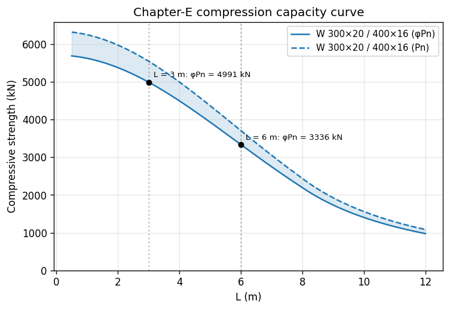
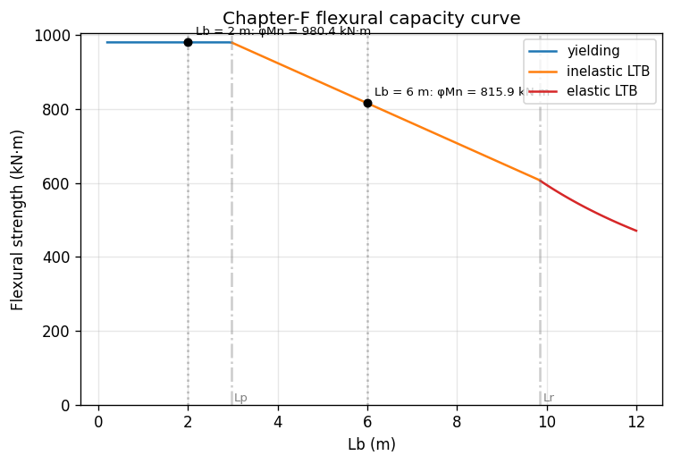

# Capacity Curves

Strength-vs-length plotters for the AISC 360-22 member checks:

| Function | Chapter | y-axis | x-axis |
| --- | --- | --- | --- |
| [`plot_compression_curve`](#compression) | §E | `φPn` (or `Pn`) | member length `L` |
| [`plot_flexural_curve`](#flexure) | §F | `φMn` (or `Mn`) | unbraced length `Lb` |

Both functions are available as free functions in `apeSteel.plotting`
and as `Element` methods. The `Element` delegates are thin pass-throughs
and accept the same keyword arguments.

!!! info "Optional dependency"
    Plotting requires matplotlib. Install with
    `pip install "apeSteel[plot]"`.

All lengths are in **mm**, all forces in **N**, all moments in **N·mm**
(apeSteel's canonical base units). The plotters rescale the axes for
display via the `length_unit`, `force_unit`, and `moment_unit`
`(value, label)` tuples — the defaults are `(m, "m")`, `(kN, "kN")`,
and `(kN·m, "kN·m")`.

---

## Compression { #compression }

```python
--8<-- "examples/plot_compression_curve.py"
```



### Behaviour

`plot_compression_curve` sweeps `lengths_L`, evaluates
`Element.phi_Pn_vs_length` at each point, and plots the resulting
Chapter-E capacity curve.

- **`ax` pass-through.** Pass an existing `matplotlib.axes.Axes` to
  overlay multiple sections on one figure. The function always returns
  the axes so calls compose. With `ax=None` a new figure is created.
- **`xscale`.** `"linear"` (default) or `"log"`. Useful when the sweep
  spans two decades of length and the short-column plateau would
  otherwise compress against the y-axis.
- **`which`.** Choose `"phi_Pn"` (the LRFD design curve, default),
  `"Pn"` (nominal), or `"both"` (draws both lines; the nominal curve
  is dashed by default).
- **`fill=True`.** Shades the safe region. With `which="phi_Pn"` or
  `"Pn"` the band runs from zero to the curve; with `which="both"`
  the band sits between `Pn` and `φPn`, visualising the φ-reduction.
- **`project_lengths`.** A sequence of bare lengths (mm) or
  `(length_mm, "label")` tuples. Each projection drops a vertical
  guide, places a marker on the curve, and annotates the φPn (or Pn)
  value in display units. Useful for tagging the actual unbraced
  length of a real column on the design curve.
- **`color_by_limit_state=True`.** Segments the curve by the
  governing AISC limit state — flexural buckling, torsional buckling,
  flexural-torsional buckling, or single-angle flexural — and emits
  one legend entry per state. This is the fastest way to see where
  the torsional or FTB branch takes over from flexural buckling.

### Element delegate

```python
element.plot_compression_curve(
    lengths_L=lengths_L,
    effective_length_factor_Kx=1.0,
    effective_length_factor_Ky=1.0,
    effective_length_factor_Kz=1.0,
    which="both",
    fill=True,
)
```

Restriction: doubly-symmetric I only (same as
`Element.phi_Pn_vs_length`).

---

## Flexure { #flexure }

```python
--8<-- "examples/plot_flexural_curve.py"
```



### Behaviour

`plot_flexural_curve` sweeps `unbraced_lengths_Lb`, evaluates
`Element.phi_Mn_vs_Lb` (symmetric: `Lb_top = Lb_bot = Lb` at every
point), and plots the Chapter-F capacity curve.

- **`ax`, `xscale`, `which`, `fill`, `project_lengths`,
  `color_by_limit_state`** behave the same as for compression. With
  `color_by_limit_state=True` the segments cover the Chapter-F
  regimes — yielding (plastic plateau), inelastic LTB, elastic LTB —
  plus FLB / WLB and compression/tension-flange yielding when the
  classifier routes to §F3/F4/F5.
- **`lateral_torsional_buckling_modification_factor_Cb`.** AISC
  Eq. F1-1. Defaults to `1.0`. Increasing `Cb` lifts the inelastic-LTB
  branch but never exceeds the plateau `Mp`.
- **`flange`.** `"top"`, `"bot"`, or `"governing"` (default).
  Plots one flange's curve, or the lower-`φMn` envelope of the two.
- **`show_landmarks=True`.** Adds vertical guides and labels at
  **Lp** and **Lr** (taken from the first curve point — these depend
  only on geometry and material, so they're constant along the sweep
  whenever classification doesn't change).

### Element delegate

```python
element.plot_flexural_curve(
    unbraced_lengths_Lb=unbraced_lengths_Lb,
    lateral_torsional_buckling_modification_factor_Cb=1.0,
    color_by_limit_state=True,
    show_landmarks=True,
)
```

Restriction: I-sections (doubly- or singly-symmetric).

---

## Overlaying multiple sections

Re-use the same `Axes`:

```python
fig, ax = plt.subplots()
for label, color in zip(family, palette, strict=True):
    catalog.get_doubly_symmetric_i_geometry(label).element(material=A992)\
        .plot_flexural_curve(unbraced_lengths_Lb=Lbs, ax=ax,
                              label=label, color=color)
ax.legend()
```

See the [design-family overlay recipe](../recipes/design_family_overlay.md)
for a worked example.
