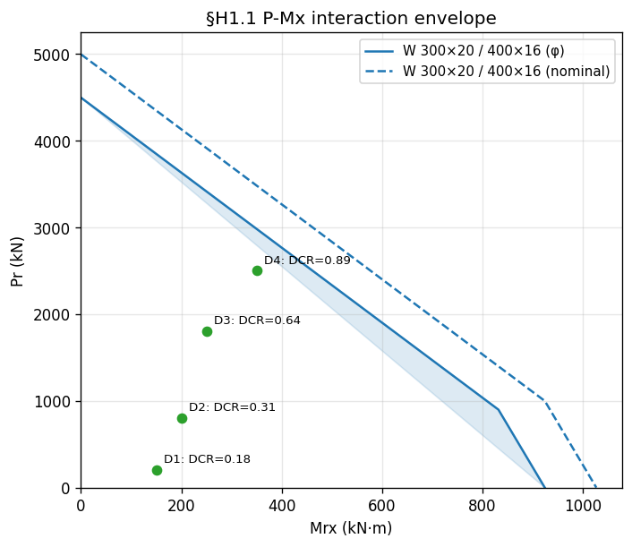
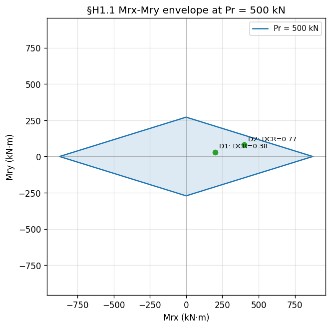
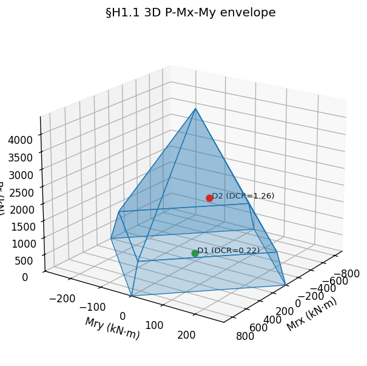

# Interaction Diagrams

Three views of the AISC 360-22 §H1.1 P-Mx-My envelope:

| Function | View |
| --- | --- |
| [`plot_pm_interaction`](#pm) | 2D uniaxial P vs Mx (Mry = 0) |
| [`plot_mm_interaction`](#mm) | 2D Mrx vs Mry at a fixed `Pr` |
| [`plot_pmm_interaction_3d`](#pmm) | full 3D P-Mx-My envelope |

All three plotters resolve capacities the same way: `Pc` from
`Element.compression_strength` (§E), `Mcx` from
`Element.run_full_check` (the §F router lands on F2/F3/F4/F5), and
`Mcy` (when needed) from §F6 minor-axis flexure.

!!! note "Restriction"
    Interaction-diagram plotters are doubly-symmetric I only — the
    same restriction as `Element.combined_strength_H1`.

If `unbraced_length_top_flange_Lb_top` / `unbraced_length_bot_flange_Lb_bot`
are not supplied, they are read from `element.bracing`. With no bracing
and no explicit values, a `ValueError` is raised.

---

## The §H1.1 envelope geometry

The §H1.1 unity check is a piecewise-linear envelope in normalised
`(P/Pc, M/Mc)` space:

$$
\begin{cases}
P_r/P_c + \tfrac{8}{9}\!\left(M_{rx}/M_{cx} + M_{ry}/M_{cy}\right) \le 1 & P_r/P_c \ge 0.2 \\
P_r/(2 P_c) + \left(M_{rx}/M_{cx} + M_{ry}/M_{cy}\right) \le 1 & P_r/P_c < 0.2
\end{cases}
$$

The two branches meet at `(P/Pc, M/Mc) = (0.2, 0.9)` — apeSteel calls
this the "kink". The uniaxial envelope is therefore **bilinear** with
three vertices: `(0, Pc)`, the kink, and `(Mcx, 0)`. At a fixed `Pr`,
the biaxial envelope is a **rhombus** with vertices on the moment
axes, shrinking linearly with axial load until it collapses to the
origin at `Pr = Pc`. The 3D envelope is the union: a cone (apex at
`(0, 0, Pc)`, base at the break rhombus) glued to a frustum (top at
the break rhombus, base at the full rhombus at `P = 0`).

---

## P-Mx (uniaxial) { #pm }

```python
--8<-- "examples/plot_pm_interaction.py"
```



### Keyword reference

- **`which`.** `"phi"` (LRFD design envelope, default), `"nominal"`,
  or `"both"`. With `"both"` the nominal curve is drawn dashed and
  the design curve solid.
- **`normalized=True`.** Plot `M/Mcx` vs `P/Pc`. The envelope collapses
  to the universal bilinear shape with vertices `(0, 1)`,
  `(0.9, 0.2)`, `(1, 0)` — the same for every section. `which`
  collapses to a single curve in this mode.
- **`fill=True`.** Shades the safe interior of the envelope.
- **`demand_points`.** A sequence of `(Pr, Mrx)` or
  `(Pr, Mrx, "label")` tuples. Each point is plotted with the §H1.1
  unity ratio (DCR) annotated:
    - **green** marker if `DCR ≤ 1.0` (inside the envelope),
    - **red** marker if `DCR > 1.0` (overstressed).
  Forces in **N**, moments in **N·mm** (base units).
- **`force_unit`, `moment_unit`.** `(value, label)` axis-rescaling
  tuples. Ignored when `normalized=True`.

### Element delegate

```python
element.plot_pm_interaction(
    effective_length_factor_Kx=1.0, unbraced_length_Lx=4.0 * u.m,
    effective_length_factor_Ky=1.0, unbraced_length_Ly=4.0 * u.m,
    effective_length_factor_Kz=1.0, unbraced_length_Lz=4.0 * u.m,
    which="both", fill=True,
    demand_points=[(1200 * u.kN, 250 * u.kN * u.m, "demand")],
)
```

---

## Mrx-Mry at fixed P { #mm }

```python
--8<-- "examples/plot_mm_interaction.py"
```



`plot_mm_interaction` draws the H1.1 rhombus at a single axial level
`axial_load_Pr`. The four vertices live on the moment axes at the
ratio-sum scale:

- `Pr/Pc ≥ 0.2` → `Mrx/Mcx + Mry/Mcy ≤ (9/8)(1 − Pr/Pc)`
- `Pr/Pc < 0.2` → `Mrx/Mcx + Mry/Mcy ≤ 1 − Pr/(2 Pc)`

### Keyword reference

- **`axial_load_Pr`** — required. Axial demand at which to slice
  (in **N**).
- **`which`** — `"phi"` (default), `"nominal"`, or `"both"`.
- **`normalized=True`** — axes become `Mrx/Mcx` and `Mry/Mcy`; the
  envelope is then a unit rhombus.
- **`fill`** — shade the safe rhombus interior.
- **`demand_points`** — `(Mrx, Mry)` or `(Mrx, Mry, "label")` tuples
  evaluated at this slice's `Pr`; green inside, red outside.

---

## 3D P-Mx-My { #pmm }

```python
--8<-- "examples/plot_pmm_3d.py"
```



`plot_pmm_interaction_3d` builds the full §H1.1 envelope as a
`Poly3DCollection`: four frustum quads from the `P = 0` rhombus up to
the break rhombus at `P = 0.2 Pc`, and four cone triangles from there
to the apex at `(0, 0, Pc)`.

### Keyword reference

- **`which`** — `"phi"` (default) or `"nominal"`. `"both"` is not
  supported in 3D (it's unreadable).
- **`face_color`, `edge_color`, `surface_alpha`** — control the
  envelope surface. The defaults (`"tab:blue"`, `0.25`) give a
  translucent envelope that lets demand points show through.
- **`demand_points`** — `(Pr, Mrx, Mry)` or
  `(Pr, Mrx, Mry, "label")` tuples; green/red colouring by §H1.1
  unity, same convention as the 2D plotters.

If you want to control the camera, build the 3D axes yourself and
pass it in:

```python
fig = plt.figure()
ax = fig.add_subplot(111, projection="3d")
element.plot_pmm_interaction_3d(ax=ax, ...)
ax.view_init(elev=20, azim=35)
```
