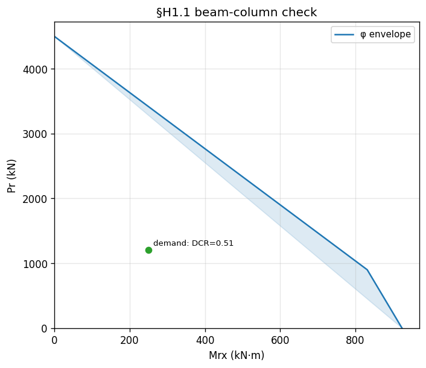

# Recipe — Beam-Column (§H1.1)

**Question.** Given an A992 W-shape carrying a combined axial
compression `Pr` and major-axis moment `Mrx` (both already
second-order — DAM-amplified by the caller), does the member pass the
AISC 360-22 §H1.1 unity check, and where does the demand point sit on
the P-Mx envelope?

**Answer.** Call `Element.combined_strength_H1`. It pulls `Pc` from
this element's Chapter-E strength and `Mcx` from its Chapter-F routed
strength (via `run_full_check`) and evaluates Eq. H1-1a or H1-1b.
Overlay the demand on the envelope with
`Element.plot_pm_interaction`.

```python
--8<-- "examples/recipe_beam_column_H1.py"
```



## Step-by-step

### 1. Compose the element

The element must carry a `Bracing` (so Chapter F can run) and must be
doubly-symmetric I (the current restriction on
`combined_strength_H1`):

```python
element = section.element(
    material=A992, construction="welded",
    bracing=Bracing(0.001 * u.m, 4.0 * u.m, 1.0),
)
```

### 2. Supply the **second-order** demands

apeSteel's §H1.1 implementation uses the Direct Analysis Method — the
caller passes `Pr` and `Mrx` already amplified. There is no
Appendix-8 B1/B2 machinery inside the check (see design note 09).

```python
required_axial_Pr = 1200 * u.kN
required_moment_x_Mrx = 250 * u.kN * u.m
```

### 3. Evaluate §H1.1

```python
h1 = element.combined_strength_H1(
    required_axial_Pr=required_axial_Pr,
    required_moment_x_Mrx=required_moment_x_Mrx,
    effective_length_factor_Kx=1.0, unbraced_length_Lx=4.0 * u.m,
    effective_length_factor_Ky=1.0, unbraced_length_Ly=4.0 * u.m,
    effective_length_factor_Kz=1.0, unbraced_length_Lz=4.0 * u.m,
)
```

The returned `CombinedH1Report` carries:

| Field | Meaning |
| --- | --- |
| `governing_equation` | `"H1-1a"` (high axial) or `"H1-1b"` (low axial) |
| `axial_ratio_Pr_Pc` | `Pr / Pc` |
| `required_moment_x_Mrx`, `available_moment_x_Mcx` | inputs / resolved `Mcx` |
| `moment_ratio_term` | `Mrx/Mcx + Mry/Mcy` |
| `demand_capacity_ratio` | LHS of the governing equation (the DCR) |
| `unity_check_passes` | `demand_capacity_ratio <= 1.0` |

Because Chapter H is an interaction chapter, the resistance factors
already live inside `Pc` and `Mcx` — the report's inherited
`phi_LRFD` is therefore `1.0`.

### 4. Plot the envelope and overlay the demand

```python
element.plot_pm_interaction(
    effective_length_factor_Kx=1.0, unbraced_length_Lx=4.0 * u.m,
    effective_length_factor_Ky=1.0, unbraced_length_Ly=4.0 * u.m,
    effective_length_factor_Kz=1.0, unbraced_length_Lz=4.0 * u.m,
    ax=ax, which="phi", fill=True,
    demand_points=[(required_axial_Pr, required_moment_x_Mrx, "demand")],
)
```

The point is green when `DCR ≤ 1.0`, red otherwise. The bilinear
envelope's three vertices are `(0, Pc)`, the kink at
`(0.9·Mcx, 0.2·Pc)`, and `(Mcx, 0)`.

## Biaxial extension

For biaxial demands, pass `required_moment_y_Mry`; `combined_strength_H1`
auto-resolves `Mcy` from §F6 minor-axis if not given (Phase F-8). For
visualisation, switch to
[`plot_mm_interaction`](../plotting/interaction_diagrams.md#mm) at a
fixed `Pr`, or
[`plot_pmm_interaction_3d`](../plotting/interaction_diagrams.md#pmm)
for the full 3D envelope.
