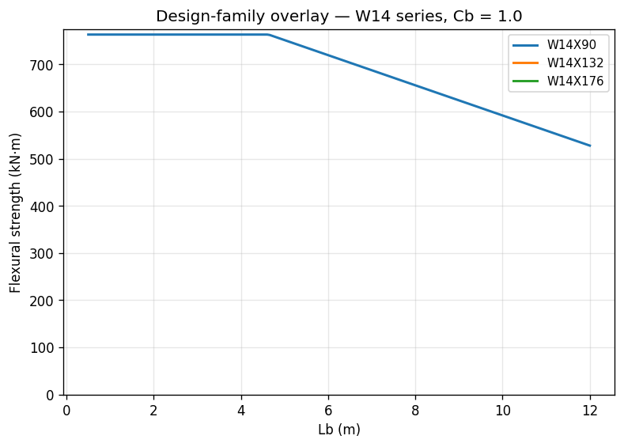

# Recipe — Design-Family Overlay

**Question.** I need to pick the lightest W14 that delivers enough
`φMn` at my unbraced length `Lb`. Can I see the Chapter-F capacity
curves of W14×90, W14×132, and W14×176 on a single chart?

**Answer.** Use `AISCv16Catalog.get_doubly_symmetric_i_geometry` to
pull each shape, build an `Element` per section, and call
`Element.plot_flexural_curve` against the **same** `Axes`. Each curve
gets a label and colour; the legend tells you which one wins at any
given `Lb`.

```python
--8<-- "examples/recipe_design_family.py"
```



## Step-by-step

### 1. Resolve each shape from the catalog

```python
catalog = AISCv16Catalog()
section = catalog.get_doubly_symmetric_i_geometry("W14X90")
```

`get_doubly_symmetric_i_geometry` returns a plate-built
`DoublySymmetricISection` reconstructed from the catalog's `(bf, tf,
tw, d)` columns. This drops the root-radius fillet contribution — the
plate-built `Ag`, `Ix`, and `J` come out slightly smaller than the
AISC published values, but the Chapter-F LTB curves are dominated by
`Sx` and `rts`, which match within rounding.

### 2. Compose elements (no bracing needed for the curve)

```python
element = section.element(material=A992, construction="rolled")
```

`plot_flexural_curve` sweeps `Lb` itself; the element does not need a
`Bracing` for this. Use `"rolled"` for catalog shapes so the
classifier picks the rolled-section `λr` for the flange.

### 3. Overlay each curve on the same `Axes`

```python
fig, ax = plt.subplots()
for label, color in zip(family, palette, strict=True):
    section = catalog.get_doubly_symmetric_i_geometry(label)
    element = section.element(material=A992, construction="rolled")
    element.plot_flexural_curve(
        unbraced_lengths_Lb=unbraced_lengths_Lb,
        lateral_torsional_buckling_modification_factor_Cb=1.0,
        ax=ax,
        label=label,
        color=color,
    )
ax.legend()
```

The trick is passing the same `ax` to each call and giving each one a
distinct `label` + `color`. The plotter returns the axes, so the
calls compose naturally — exactly the pattern you'd use to mix
capacity curves with demand points, code curves from a reference, or
EN 10365 IPE shapes pulled from `EuropeanIPECatalog`.

### Extending the comparison

- **Different `Cb`.** Pass
  `lateral_torsional_buckling_modification_factor_Cb=1.67` to lift the
  inelastic-LTB branch — the plateau and elastic-LTB asymptote are
  unchanged.
- **Compression curves.** Same pattern with `plot_compression_curve`
  and `lengths_L = np.linspace(0.5 * u.m, 12 * u.m, 200)`.
- **`color_by_limit_state=True`** on each curve to see whether a heavy
  shape transitions to elastic LTB sooner than a lighter one.

## See also

- [Plotting → Capacity Curves](../plotting/capacity_curves.md) for the
  full keyword reference.
- [Beam-Column (H1.1)](beam_column_H1.md) for combined-action
  envelopes on one shape.
